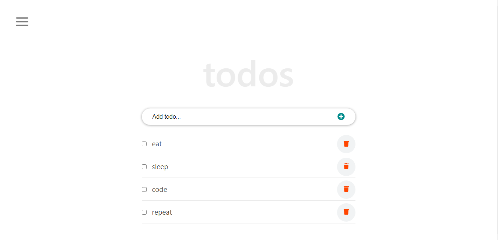

<div align="center">
  <!-- You are encouraged to replace this logo with your own! Otherwise you can also remove it. -->
  
  <br/>
</div>

## [Click to See the Todos App](https://ibaslogic.github.io/react-todo-project/)

The code is available in the `src` folder. In there, you’ll see two folders named `classBased` and `functionBased` holding the class component and function component code respectively.

### Clone the project

You can download or clone this project by running this command from your terminal:

```
git clone https://github.com/Ibaslogic/react-todo-app
```

This will create a directory in the name of the project folder.

Once you have the project files and folders bootstrapped, open it with your text editor.

Next, switch inside the project directory and run:

```
npm install
```

This will install all the necessary dependencies in the local `node_modules` folder.

Finally, start your development server by running:

```
npm start
```

You should see the app in your browser address bar at [http://localhost:3000](http://localhost:3000)